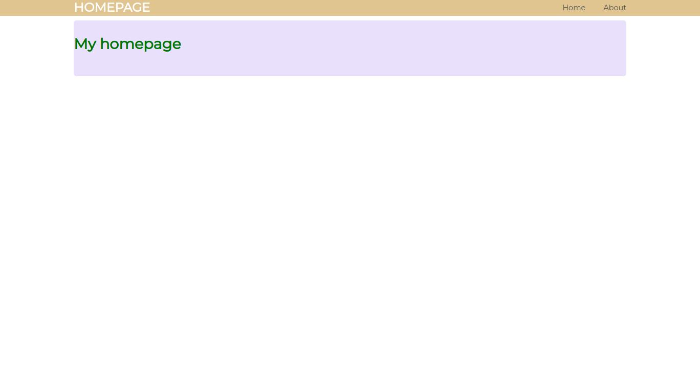

<h1 align="center">👾 Personal Website
    
</h1>

    
    
    

 

- Python
- Flask
- Html
- Css

---

# Installation on Linux and Unix like OS

- `git clone https://github.com/lenargasimov/personal-website.git`
- `cd personal-website`
- `python3 main.py`

# Instalation on Windows

- `git clone https://github.com/lenargasimov/personal-website.git`
- `cd personal-website`
- `python main.py`
